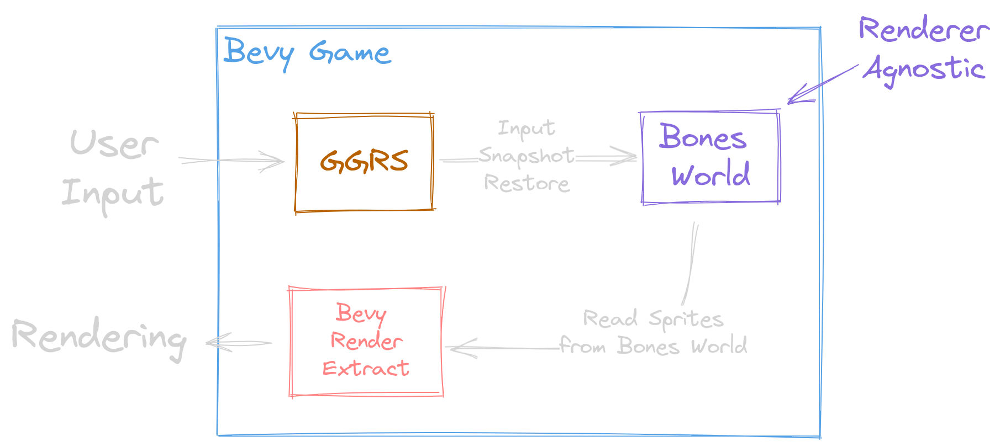

<!--
Major points to cover:

- Why we we felt the need to move away from Bevy to our own solution.
- How we moved piece-by-piece away from Bevy to Bones.
- What the technology ended up, and how it works.
 -->

### From Bevy to Bones

<!-- .slide: data-timing="8" -->

**"Accidentally" Making a Game Engine**

Notes:

- Hey everyone!
- Today I'm going to talk about mine and the Jumpy community's journey from Bevy to Bones
- as we "accidentally" made a game engine.

---

<!-- .slide: data-auto-animate data-timing="8" -->

Isn't This a _Bevy_ Meetup?

Notes:

- The first thing you might be asking is, "isn't this a _Bevy_ meetup?
- The answer to that of course is yes, but
- as you'll see ⏭

---

<!-- .slide: data-auto-animate data-timing="8" -->

Isn't This a _Bevy_ Meetup?

Yes, **we couldn't have made <u>Bones</u> without <u>Bevy</u>**

Bones is like Bevy's **little brother**

<!-- .element: class="fragment" style="margin-top: 1em"  -->

Notes:

- we couldn't have made Bones without Bevy
- Bones was **heavily** influenced by Bevy's design and is in fact
- ⏭️ kind of like Bevy's little brother.

---

## What is Jumpy?

<!-- .slide: data-timing="10" data-background-video="jumpy-presentation.webm" data-background-video-muted="true" data-background-opacity="0.50" data-background-video-loop="true" -->

2D <!-- .element: class="fragment fade-left"  -->

Multiplayer <!-- .element: class="fragment fade-right"  -->

Shooter Game <!-- .element: class="fragment fade-up"  -->

✨ With Modding ✨ <!-- .element: class="fragment"  -->

Notes:

- That brings us to "What is Jumpy?"
- Jumpy is a
- ⏭ ️2D
- ⏭️ Multiplayer
- ⏭️ Shooter Game
- that's all about fun couch play, emergent gameplay, and importantly ⏭️
- ✨ _modding_ ✨

---

### Rewriting Jumpy In Bevy

<!-- .slide: data-timing="10" -->

<ul>
    <li>Jumpy was using <a href="https://macroquad.rs/" target="_blank">Macroquad</a></li>
    <li>But we were already using Bevy for <a href="https://github.com/fishfolk/punchy/" target="_blank">Punchy</a></li>
</ul>

Notes:

- When I took over as lead developer for Jumpy, it was currently written with Macroquad.
- But we were already using bevy for Punchy, another game in the Fish Folk universe, and it was going very well.

---

### Advantages to Bevy

<!-- .slide: data-timing="25" -->

- Large community
- Good cross-platform support
- We already had prior Bevy investments:
  - Nested YAML Asset System
  - Scripting: <code style="font-size: 0.7em; margin-left: 0.5em;">bevy_mod_js_scripting</code>

Notes:

- That led us to consider rewriting Jumpy in Bevy.
- There were some compelling advantages.
- For one, Bevy had a large and growing community, which had already shown a lot of ability to get
  things done
- It had good cross-platform and rendering support, and we would be able to re-use some of the Bevy
  stuff that we had made for Punchy.
- A particularly appealing thought was that we would be able to use the new `bevy_mod_js_scripting`
  plugin that I had recently integrated with Punchy.

---

### Start Working! 👨‍🔧

<!-- .slide: data-timing="20" -->

    
    
+

    

    
Maps Loading

    
Physics Ported

    
Main Menu

    
Map Editor

Notes:

- So to enable modding and to use the same engine for more of our games, we started rewriting Jumpy in Bevy.
- This actually went really well. We got
- ⏭️ maps loading,
- ⏭️ physics ported,
- the ⏭️ main menu,
- and even had the start to an in-game ⏭️ map editor, all in pretty good time.
- Then came the next big hurdle, and something I had never done before

---

<!-- .slide: data-auto-animate data-timing="2" data-background-image="networking-cc0-upscaled.png" data-background-opacity="0.85" data-background-transition="zoom" -->

<h2>Networking</h3>

Notes:

- Networking.

---

<!-- .slide: data-auto-animate data-timing="18" -->

<h2 style="position: relative; top: -1em">Networking</h2>

<h3 style="color: #22D491;">Naïve Client-Server</h4>

- Horrible skipping and jittering during play
- Networking code is mixed with gameplay code

Notes:

- I started off with a client-server model, running a headless Bevy instance on the server and synchronizing transforms.
- While it kind of worked, the players were constantly skipping and jittering around during play.
- Additionally, the networking code had to be mixed in with the gameplay code. It was easy to make a change in the game that would
  break networking unintentionally.

---

<!-- .slide: data-timing="45" -->

<h2 style="position: relative; top: -1em">Networking</h2>

<h3 style="color: #22D491;">Client-Server With Latency Compensation</h4>

- Requires some form of sync-then-fast-forward.

Notes:

- After doing more research I found out that, in order to get smoother network play, I have to take into account the network latency between the client and the server.
- This means that when the client gets an update from the server, the game must realize that the update actually came from, say 100ms ago, because of the network ping, and
  then it has to actually play the game in fast-forward, behind the scenes, to catch up to the present time.
- This was doable, for sure, but if I was going to bother with syncing and fast-forwarding, this was going to be harder than I thought, and it was worth considering another networking model first.

---

<!-- .slide: data-timing="36" -->

<h2 style="position: relative; top: -1em">Networking</h2>

<h3 style="color: #22D491;">Peer-to-Peer Rollback</h4>

- Doesn't require servers!
- Requires <u>Determinism</u> and <u>Snapshot & Restore</u>
- Gameplay code is cleanly separate from network code

Notes:

- Peer-to-peer rollback networking does a similar rewind and fast-forward thing, but it doesn't require running a headless Bevy instance on a server.
- That's really handy for making network gaming inexpensive or even free, which is a big deal for our idea of "Everlasting games".
- The caveat is that it requires the game to be deterministic, and to support snapshot and restore.
- These features are harder to get than they might seem, but there's a great payoff.
- The peer-to-peer model gets you essentially the most fair and best feeling networking out of any other solution I've found.
- It also had one other big advantage:
- The networking code could stay completely separate from the gameplay code.
- This would make it **way** easier for us to ensure that network games worked just as well as local games.
- Lucky for us, Bevy already had peer-to-peer networking plugin, called Bevy GGRS.

---

<!-- .slide: data-timing="30" data-auto-animate -->

### Bevy GGRS

- Might run up to 8 game updates in a single frame
- Each game update must finish in less than 2ms
- `bevy_mod_js_scripting` was not fast enough on web
- No more scripting for now.

Notes:

- We started using Bevy GGRS for Jumpy, and we were very happy with how it simplified the game code.
- Unfortunately we ran into a performance problem with our scripting solution.
- Since GGRS has to do rollbacks and fast-forwards depending on network conditions, it may run the game update up to 8 times in a single render frame.
- This means that our game update, if we are targeting 60 frames-per-second, has to finish within 2 milliseconds!
- Unfortunately, we found out that the `bevy_mod_js_scripting` plugin had too much overhead on web, even though it worked fine on native.
- It's just not very fast to make calls out of WASM into the browser.
- So for now, we decided to just remove scripting and look more into it later.

---

<!-- .slide: data-auto-animate data-timing="64" -->

### Bevy GGRS

- ✅ &nbsp; Handles the snapshot / restore for you!
- ❌ &nbsp; You have to be careful not to break snapshots or determinism:
  - Can't use events or `Local<State>` parameters
  - `GlobalTransform`s can't be read
  - All queries must be sorted
  - You must attach a `RollbackId` to synced entities
  - You must be careful with entity hierarchies in some situations
  - Storing `Entity`s in components requires implementing `MapEntities`

Notes:

- As we continued to use Bevy GGRS, we ran into quite a few gotchas.
- Bevy's design is very focused on performance, and that, in most cases, comes at the expense of determinism.
- On top of that, very little in Bevy lends itself to snapshot and restore.
- This meant that there were a lot of Bevy features we either couldn't use, or had to be extra careful with.
- Things like events, `Local` system params, and `GlobalTransforms` couldn't be used.
- Almost all queries had to be collected into a vector and sorted before we could safely iterate over them, to avoid the non-deterministic iteration order.
- Finally, you have to attach rollback IDs to entities you want to sync,
- you have to be careful with how you use hierarchies,
- and storing `Entity`s in components requires implementing an extra `MapEntities` trait.
- All of these things were really easy to miss, and it was now a looming threat that with every change we made to the game, we could accidentally break determinism.
- It felt like a new kind of "undefined behavior" to avoid, and in that respect, all the code was now `unsafe`.
- These issues weren't GGRS's fault, there were just no good ways get deterministic snapshot restore in Bevy.

---

<!-- .slide: data-timing="30" -->

### A Deterministic Box

A _tiny_ ECS

With a `World` that you can `.clone()`

Notes:

- This led to a good deal of thinking about possible solutions.
- We could re-consider client-server, but it seemed like we'd still have a similar feeling of "undefined behavior" by having to do network-specific handling
  all throughout our gameplay code again.
- I started thinking about what it would take to put the Jumpy's core gameplay logic in it's own deterministic "Box".
- We could make our own simple ECS that we could use, and we could make the whole world `.clone()`-able so that it would be trivial to snapshot and restore.
- Or better than making our own, we could just find somebody else who did it.

---

<!-- .slide: data-timing="41" -->

### Bone ECS: First Pass

- Start with a fork of Planck ECS
- Planck component storage is built on `Vec<T>` and bitsets
- Modify component storage to allow for runtime-defined types
- Bones ECS is easier to script than Bevy ECS

Notes:

- We started off by forking Planck ECS, the simplest Rust ECS I could find.
- Planck used normal Rust vectors for storage, and used bitsets operations to do queries over components.
- The only one major modification I wanted to make to it was to allow us to store runtime-defined types.
- This was a step back in the direction of scripting.
- Because Bones ECS was going to stay small and simple, it would be much easier to implement scripting for.
- While there was promising progress with `bevy_mod_js_scripting` it was also very complicated, and there were still big questions
  about how to make certain things work in scripts, especially when it came to interacting with assets.
- By doing our own scriptable ECS for the gameplay, it would be easier to get the modding experience we were looking for.

---

<!-- .slide: data-timing="64" -->

### Bevy + Bones

  

Notes:

- After finishing the first draft of the Bones ECS, we started porting the core Jumpy gameplay to use it instead of the Bevy ECS.
- This was a big-ish rewrite, and there was a lot more boilerplate than I imagined to get input and rendering types made for Bones.
- We also had to postpone proper asset handling, and a temporary, annoying integration with Bevy's asset server was used to get things rolling.
- The good news was that porting was straight-forward, if tedious.
- By the time we finished, we had a rather interesting architecture.
- When you started a match, it would create a new Bones world, initialize the game, and then start sending input to it.
- We created a bevy system that would render whatever sprites and tilemaps that it found in the bones world.
- For network games, GGRS would send the input to the bones world, as well as instruct it to create or restore snapshots when necessary.
- After a lot of work we finally had a nice and clean architecture, where we didn't have to think constantly about networking.
- We also got an interesting bonus, the Jumpy match gameplay was now renderer agnostic.
- Because it was isolated and deterministic, we could have rendered it in Bevy, or macroquad without changing the gameplay at all.

---

<!-- .slide: data-timing="16" -->

### Problems With Bevy + Bones

- Now we have two ECS's to deal with
- The asset integration is annoying
- The Bones world can't render UI

Notes:

- There were still things to be desired, though.
- Having to deal with two different ECS's and schedulers could be confusing.
- The asset integration still required annoying conversions between bones and bevy asset paths.
- And the bones world couldn't render UI, because all the UI was in the outer Bevy shell.

---

<!-- .slide: data-timing="47" -->

### Bones Framework

- Create a new Bones Framework
- Start moving pieces of Jumpy into Bones
  - Egui & Widgets
  - GGRS & Networking
- Use a multi-`World` pattern to keep core gameplay isolated
- Make Bevy a supported Bones Framework renderer
- Create a proper Bones asset server

Notes:

- The next step, was to create a unified Bones Framework.
- We would start moving pieces of Jumpy into the new framework, such as the Egui widgets and the networking logic.
- We would use a multi-`World` strategy, so that you could have one bones world for the menu that would create separate, isolated gameplay worlds for the matches.
- This multi-`World` setup let us keep all the great advantages of having a separate gameplay world, while only needing to learn one ECS.
- The end result, is that the whole entire game could be made with Bones alone.
- Then we would use Bevy as a rendering integration.
- Bones games are renderer agnostic, they take bones-formatted input and create standardized rendering components.
- Any renderer that could render sprites, tilemaps, egui, and debug lines, could be integrated as a renderer, but Bevy would be our official renderer.
- The can of worms in this whole setup was the asset server.

---

<!-- .slide: data-timing="35" -->

### Bones Asset Server

- Assets are either `Metadata` assets or `Custom` assets
- `Metadata` assets:
  - are loaded from YAML files
  - can reference other assets in a hierarchy
  - are automatically deserialized into Rust structs
- Custom asset server would enable:
  - User-installed asset packs
  - Network mod synchronization

Notes:

- The Bones asset server was going to better facilitate the way we handled assets in Jumpy.
- In Jumpy, we have a concept of metadata assets.
- These assets are loaded from YAMl files and deserialized into Rust structs.
- Metadata assets contain all of our game config, and can reference other assets to build an asset hierarchy.
- In Bevy we had a custom derive macro that could be used to automatically generate asset loaders
  from our Rust structs.
- This derive setup, though, had some rough edges and with our own asset server, we could make it
  really seamless.
- We could also add first-class support for user-installed asset and mod packs.

---

<!-- .slide: data-timing="33" -->

### Runtime Defined Types

- Different asset types have different extensions
  - `.weapon.yaml`
  - `.map.yaml`
- Metadata assets are validated when loaded
  - A `blunderbass.weapon.yaml` must match the `weapon` schema
- Mods can define _new_ schemas

Notes:

- The new metadata asset deserialization took more thought than I anticipated, though.
- The reason was that I wanted to be able to deserialize runtime-defined types.
- For example, when the asset server loads `blunderbass.weapon.yaml`, it makes sure that the YAML file matches the `weapon` schema.
- When you write Rust, this weapon schema would be derived from the Rust struct.
- If you write a scripted mod, though, it may need to load assets that have never been defined in Rust.
- There has to be a way for mods to define their own schemas for assets.

---

<!-- .slide: data-timing="58" -->

### Bones Schema

- Very similar in purpose to Bevy Reflect
- Designed specifically to support scripting
- Describes a stable memory layout
  - Unlike Bevy Reflect
  - Built on `#[repr(C)]`
- Rust structs can derive `HasSchema`
- Used by the asset server for metadata assets
- Used by the ECS for all component storage
  - Enables storing runtime defined types

Notes:

- Interestingly, this is the _same_ thing that we needed for scripting.
- The more I thought about it, the more I realized that the asset server, our scripting solution, and even the Bones ECS itself, all needed the same thing:
- a way to describe the layout of data.
- This spawned the development of the Bones Schema crate.
- Bones Schema is very similar in purpose to Bevy Reflect, but it is implemented very differently.
- Instead of using trait objects, like Bevy reflect, we use `Schema`s to describe a C memory layout.
- By adding a `#[repr(C)]` annotation to a Rust struct and deriving `HasSchema`, you get a description of the Rust type's exact memory layout.
- This can be used by the asset server to deserialize assets that match our Rust structs.
- It can also be used by scripting implementations, allowing them to read and modify the data in the Rust types.
- Finally, it worked very elegantly into the design of Bones ECS, allowing it to store anything that has a `Schema`,
- even if that schema was registered at runtime, by a language other than Rust.

---

<!-- .slide: data-timing="47" -->

### Migrating to the Bones Framework

- Finished Bones Schema
- Integrated it with the Bones ECS
- Finish the Bones asset server
- Move reusable pieces of Jumpy into the Bones Framework
- Migrate Jumpy to use the Bones Framework

Notes:

- While Bones Schema is quite simple in concept, there was a lot to figure out, and it was a big task.
- It took longer than we planned, but we were accomplishing more than we planned, too.
- We had hoped to finish an asset server, and ended up laying the foundation for scripting at the same time.
- I was also really happy with how much more elegant the internals of the Bones ECS were, now that
  it was using Bones Schema to wrap up most of the `unsafe` code.
- After we finally finished Bones Schema and the Bones asset server, we were ready to start moving pieces of Jumpy into the Bones framework.
- This was also really nice, because now our other games could start to re-use things that we had developed for Jumpy.
- Once that was done, we migrated Jumpy completely to the Bones Framework, removing all direct interaction with Bevy.
- Jumpy was now fully a Bones game, and independent from it's renderer.

---

<!-- .slide: data-timing="66" -->

### Bones Scripting

- With Bones Schema in place, we were ready for a scripting language
- We collaborated with `@kyren` and used their Lua VM, `piccolo`
  - Using `piccolo` requires no `unsafe`
  - `piccolo` runs in the browser with the `wasm32-unknown-unknown` target
- Finally we have modding! 🎉

Note:

- Now that we had finished migrating Jumpy, we were tantalizingly close to supporting scripting.
- As far as we knew, everything was already in place, other than the scripting language itself.
- We decided on `piccolo` , a Lua implementation written in pure Rust.
- It had big plusses in that it could be used with without any `unsafe`, and it could target web with the `wasm32` target.
- `@kyren`, the author of `piccolo` was _super_ helpful, and worked with us to get the few features we needed in `piccolo` that weren't there yet.
- After, again, more work than we thought, we were finally able to implement a Jumpy item in Lua, and even hot reload it while the game was running!
- Personally, this was a huge milestone, as I had been trying and failing to get modding into multiple game engines for years,
- starting with Godot, then Armory3D, then Bevy, and finally, Bones.
- Finally it was working!
- And the beautiful thing about it, is that it was implemented right into the core ECS.
- Scripts were able to change any `#[repr(C)]` data in the ECS, without us having to explicitly add Lua bindings.
- Now modders and developers could operate on the same world data, without clunky, manually written API bindings.

---

<!-- .slide: data-timing="60" -->

### Jumpy & Bones Today

- Bones continues to prove it's worth
- Jumpy currently uses Bevy for rendering
- We are considering writing our own renderer using WGPU
  - Removes a large number of dependencies from Bevy
  - Cleans up our rendering integration

Notes:

- And that brings us to today
- Bones continues to prove its worth as we keep developing and improving Jumpy.
- Jumpy still uses Bevy as it's renderer, but we are considering writing our own renderer, too.
- Jumpy's rendering needs are very simple: we've got sprites, tilemaps, egui, and debug lines,
  that's it.
- Right now, though, we are pulling in a chunk of Bevy code like Bevy Reflect, the Bevy ECS, and the
  Bevy renderer, that is much larger than it needs to be for our use-case.
- This affects compile times, which, while not the most important thing in the world, is impacting contributors.
- Also, Bevy's ECS-driven rendering strategy is not very nice to work with when we are trying to
  render things from another ECS.
- We currently have a good way to inject our sprites into Bevy's render extract phase, but a recent
  update in Bevy ruined that, so we haven't updated beyond Bevy `0.11`.
- We end up either having to write our own sprite renderer for Bevy, or
  we have to synchronize entities, which is not very efficient and is annoying and tricky.
- This means it might be cleanest for us just to make our own renderer.

---

<!-- .slide: data-timing="42" -->

### Bones 🤝 Bevy

- We never meant to make a game engine
- We never could have done it without Bevy
- It enabled us to explore and branch out, while still working on our game
- Bevy allowed us to replace different pieces of it one-by-one
- Bones has learned so much from Bevy

Notes:

- So, we never meant to make a game engine.
- Our goal was to make we needed for networking and modding, in a way that we could share it with all our Rust games.
- It turned out that what we needed, hadn't been made yet, and by building it step-by-step, we were
  able to make what we needed, even while still working on our game!
- This would not have been possible without Bevy.
- Bevy's modular design allowed us to replace pieces of it while keeping other pieces that we still needed.
- Bevy also inspired many parts of bones; we learned a lot from it, and we still follow Bevy's
  journey and learn from Bevy discussions and development.
- While we may not continue to use Bevy, if we make our own renderer, Bones will forever be in Bevy's debt,
  and never would have existed without it.

---

<!-- .slide: data-auto-animate data-auto-animate-id="simple" data-timing="35" -->

### A Simple Schema

<pre><code data-line-numbers="|4-7|3|10-11" data-trim>
use bones_schema::prelude::*;

#[derive(HasSchema, Clone, Default)]
struct Position {
    x: f32,
    y: f32,
}

fn main() {
  let schema = Position::schema();
  dbg!(schema);
}
</code></pre>

Note:

- Finally, I wanted to share some short code examples for Bones Schema.
- I think Bones Schema is probably one of the most interesting and original pieces of Bones, and it's also the piece that could be most useful to other non-bones projects,
- so I think it'll be fun to look at and get an idea of what's possible with it.

--

- First we're going to peek at the simplest thing you can do, which is derive the `HasSchema` trait on a Rust struct. ⏭️
- Here we've got a simple `Position` struct with an `x` and a `y` field. ⏭️
- We are just going to derive the `HasSchema`, `Clone`, and `Default` traits.
- The `HasSchema` trait has one function on it that returns the `Schema` for the implementing type.
- To see what that looks like, we're going to get our `Position` struct's schema and debug print it. ⏭️

---

<!-- .slide: data-auto-animate data-auto-animate-id="simple" data-timing="34" -->

### A Simple Schema

<pre style="font-size: 0.6em"><code data-line-numbers="|6-7|8-13" data-trim>
[src/main.rs:11:5] schema = Schema {
    id: SchemaId {
        id: 0,
    },
    data: SchemaData {
        name: u!("Position"),
        full_name: u!("bones_schema_test::Position"),
        kind: Primitive(
            Opaque {
                size: 8,
                align: 4,
            },
        ),
        type_data: TypeDatas(
            [],
        ),
        type_id: Some(
            TypeId {
                t: (
                    15945696820052270695,
                    11636597896589064102,
                ),
            },
        ),
        ..
    },
    layout: Layout {
        size: 8,
        align: 4 (1 << 2),
    },
    field_offsets: [],
}
</code></pre>

Note:

- As you can see, we get a lot of stuff here.
- We're going to look at just a couple things for the moment. ⏭️
- We can see that the schema tells us the short name and the full name of our type, which is very
  handy for debugging, and for figuring out which type to import by name in scripts. ⏭️
- We can also see what _kind_ of data makes up the schema.
- In this case we see that it's an opaque primitive.
- Since it's opaque all we know about the type is it's size and alignment.
- That's not very much info, but it's just enough that we can insert the type into, for example, and
  ECS.
- If we want any kind of scripting powers, though, we need more info.

---

<!-- .slide: data-auto-animate data-auto-animate-id="reprc" data-timing="10" -->

### `#[repr(C)]` Schema

<pre ><code data-line-numbers="|4" data-trim>
use bones_schema::prelude::*;

#[derive(HasSchema, Clone, Default)]
#[repr(C)] // <----
struct Position {
    x: f32,
    y: f32,
}

fn main() {
  let schema = Position::schema();
  dbg!(schema);
}
</code></pre>

Note:

- That brings us to `#[repr(C)]`
- Here we have the exact same sample, ⏭️ but with an added `#[repr(C)]` annotation to our struct.
- ⏭️

---

<!-- .slide: data-auto-animate data-auto-animate-id="reprc" data-timing="15" -->

### `#[repr(C)]` Schema

<pre><code data-line-numbers="8|10|12-14|15|22-24" data-trim>
[src/main.rs:12:5] schema = Schema {
    id: SchemaId {
        id: 1,
    },
    data: SchemaData {
        name: u!("Position"),
        full_name: u!("bones_schema_test::Position"),
        kind: Struct(
            StructSchemaInfo {
                fields: [
                    StructFieldInfo {
                        name: Some(
                            u!("x"),
                        ),
                        schema: Schema {
                            id: SchemaId {
                                id: 0,
                            },
                            data: SchemaData {
                                name: u!("f32"),
                                full_name: u!("std::f32"),
                                kind: Primitive(
                                    F32,
                                ),
                                type_data: TypeDatas(
                                    [],
                                ),
                                type_id: Some(
                                    TypeId {
                                        t: (
                                            472265404662890772,
                                            9774757227469882430,
                                        ),
                                    },
                                ),
                                ..
                            },
                            layout: Layout {
                                size: 4,
                                align: 4 (1 << 2),
                            },
                            field_offsets: [],
                        },
                    },
                    StructFieldInfo {
                        name: Some(
                            u!("y"),
                        ),
                        schema: Schema {
                            id: SchemaId {
                                id: 0,
                            },
                            data: SchemaData {
                                name: u!("f32"),
                                full_name: u!("std::f32"),
                                kind: Primitive(
                                    F32,
                                ),
                                type_data: TypeDatas(
                                    [],
                                ),
                                type_id: Some(
                                    TypeId {
                                        t: (
                                            472265404662890772,
                                            9774757227469882430,
                                        ),
                                    },
                                ),
                                ..
                            },
                            layout: Layout {
                                size: 4,
                                align: 4 (1 << 2),
                            },
                            field_offsets: [],
                        },
                    },
                ],
            },
        ),
        type_data: TypeDatas(
            [],
        ),
        type_id: Some(
            TypeId {
                t: (
                    16884739941262504889,
                    10590392532827682936,
                ),
            },
        ),
        ..
    },
    layout: Layout {
        size: 8,
        align: 4 (1 << 2),
    },
    field_offsets: [
        (
            Some(
                "x",
            ),
            0,
        ),
        (
            Some(
                "y",
            ),
            4,
        ),
    ],
}
</code></pre>

Note:

- Now, when we run the example, instead of seeing an opaque primitive type, we see a `struct` type. ⏭️
- The struct info tell us the fields of the struct ⏭️
- The names of each field ⏭️
- And the schema of each field ⏭️
- Finally, by looking at the schema of the `x` field, ⏭️ we can see that it is a primitive `f32`.
- The schema now has enough info for scripts to come in and edit the memory of the struct, without
  triggering undefined behavior.
- The schema tells us what can be safely done with the data.
- ⏭️

---

<!-- .slide: data-timing="56" -->

### `SchemaBox` for Type Erasure

<pre style="font-size: 0.5em"><code data-line-numbers="3-16|19-24|25-26|28|30|31-32" data-noescape data-trim>
use bones_schema::prelude::*;

#[derive(HasSchema, Clone, Default)]
#[repr(C)]
struct Position {
    x: f32,
    y: f32,
}

#[derive(HasSchema, Clone, Default)]
#[repr(C)]
struct Velocity {
    x: f32,
    y: f32,
    angular: f32,
}

fn main() {
    let pos = Position { x: 10.0, y: 5.0 };
    let vel = Velocity {
        x: 2.0,
        y: 4.0,
        angular: 0.0,
    };
    let pos_box = SchemaBox::new(pos);     // Like Box&lt;dyn Any&gt;
    let vel_box = SchemaBox::new(vel);

    let boxes = vec![pos_box, vel_box];

    for b in &boxes {
        if let Ok(pos) = b.try_cast_ref::&lt;Position&gt;() {
            dbg!(pos.x, pos.y);
        } else if let Ok(vel) = b.try_cast_ref::&lt;Velocity&gt;() {
            dbg!(vel.x, vel.y, vel.angular);
        }
    }
}
</code></pre>

Notes:

- Now we're going to look at what kinds of abilities this gives us in Rust.
- We'll start by adding another struct, in this case a `Velocity` struct, that also derives `HasSchema`.
- ⏭️ First we create an instance of a Position and a Velocity
- ⏭️ Then we stick them both in their own `SchemaBox`es.
- The `SchemaBox` is one of the most used types in Bones schema, and is in fact very much like a `Box<dyn Any>`.
- By putting the position and the velocity in boxes we "erase" the type, so to speak, so that even
  though there are different types on the inside, they are the same type on the outside.
- ⏭️ This lets us do things like stick both of them inside the same vector, which is impossible
  normally, because every item in a vector must be the same type.
- ⏭️ Now we can loop over the items in the vector.
- ⏭️ And attempt to cast it to a specific type, printing the data if the cast succeeds.
- This is not really any different than what you can already do with a `Box<dyn Any>`, though.
- Let's get a little deeper. ⏭️

---

<!-- .slide: data-timing="44" -->

### `SchemaBox` for For Runtime Field Access

<pre style="font-size: 0.5em"><code data-line-numbers="30-36|31|32-34|35-39" data-noescape data-trim>
use bones_schema::prelude::*;

#[derive(HasSchema, Clone, Default)]
#[repr(C)]
struct Position {
    x: f32,
    y: f32,
}

#[derive(HasSchema, Clone, Default)]
#[repr(C)]
struct Velocity {
    x: f32,
    y: f32,
    angular: f32,
}

fn main() {
    let pos = Position { x: 10.0, y: 5.0 };
    let vel = Velocity {
        x: 2.0,
        y: 4.0,
        angular: 0.0,
    };
    let pos_box = SchemaBox::new(pos);
    let vel_box = SchemaBox::new(vel);

    let boxes = vec![pos_box, vel_box];

    for my_box in &boxes {
        let my_ref: SchemaRef = my_box.as_ref(); //   Like &dyn Any
        let x: &f32 = my_ref
            .field("x").unwrap()
            .try_cast().unwrap();
        dbg!(x);
    }

    // [src/main.rs:33:9] x = 10.0
    // [src/main.rs:33:9] x = 2.0
}
</code></pre>

Notes:

- Because the schemas of `#[repr(C)]` types describe the fields of the type, we are able to access fields by their names at runtime.
- Here we have the same example as last time, but we modify the loop ⏭️
- Instead of trying to cast to a specific Rust type, now we use the `as_ref()` function get a
  `SchemaRef`, which is similar to a reference `dyn Any`. ⏭️
- Unlike `dyn Any`, though, we are able to extract fields by name, from the reference.
- We use the field function to try and get a field named `"x"` and then we try to cast it to an f32.
- ⏭️ This lets us print the `x` field of each item in our vector, even though one of them is a
  `Position` and the other one is a `Velocity`.
- This kind of ability is essential for scripting, and also very useful for things like ECS world explorers.
- ⏭️

---

<!-- .slide: data-timing="42" -->

### `SchemaBox` for Deserializing

<pre style="font-size: 0.55em"><code data-line-numbers="19-22|25|26-28|29|31-33" data-noescape data-trim>
use bones_schema::prelude::*;
use serde::de::DeserializeSeed;

#[derive(HasSchema, Clone, Default)]
#[repr(C)]
struct Position {
    x: f32,
    y: f32,
}

#[derive(HasSchema, Clone, Default)]
#[repr(C)]
struct Velocity {
    x: f32,
    y: f32,
    angular: f32,
}

static MY_POS: &str = r#"
x: 10
y: 5.5   
"#;

fn main() {
    let yaml_deserializer = serde_yaml::Deserializer::from_str(MY_POS);
    let pos_box: SchemaBox = SchemaDeserializer(Position::schema())
        .deserialize(yaml_deserializer)
        .unwrap();
    let pos: Position = pos_box.try_cast_into().unwrap();

    dbg!(pos.x, pos.y);
    // [src/main.rs:30:5] pos.x = 10.0
    // [src/main.rs:30:5] pos.y = 5.5
}
</code></pre>

Notes:

- We can also use Bones schema for serializing and deserializing.
- For example, if we have this small YAML snippet that we want to deserialize into a Position.
- We haven't derived `serde::Deserialize` for `Position`, but we do have all the info we need
  already in the `Schema`. ⏭️
- We can create a normal `serde_yaml` Deserializer from our YAML snippet. ⏭️
- And then create a `SchemaDeserializer` for our `Position` schema, and use it to load the data into a SchemaBox.
- ⏭️ After we have the box, we can cast it into a `Position`
- ⏭️ and prove that the YAML data was correctly loaded by printing it.
- This functionality is extremely useful in the Bones asset server, allowing us to automatically
  load YAML assets into Rust structs.
- ⏭️

---

<!-- .slide: data-timing="31" -->

### `Schema` for Runtime Defined Types

- `Schema`s can be derived, but they can also be loaded from files at **runtime**.
- All of the `Schema` features work the same for runtime-loaded schemas:
  - Schema boxes
  - Runtime field access
  - Deserialization
- Scripts & Bones ECS can access all the `#[repr(C)]` data regardless of it's source.

Note:

- An important thing to note at this point is that schemas can be derived, but they can also be
  loaded from files at runtime.
- For example, mods can define their own schemas for types that never existed in Rust.
- Even still, all of the schema features work the same.
- You can store the data in schema boxes, or in the bones ECS, you can access fields at runtime, and
  you can deserialize the data using serde.
- Scripts and the Bones ECS can access all of the `#[repr(C)]` data, regardless of it's source.

---

<!-- .slide: data-auto-animate data-timing="35" -->

### Associated Type Data

#### Use-Case

- In our game, we know we will spawn thousands of certain components.
- We want the ECS to pre-allocate storage for those components so we can avoid re-allocations later.
- We create a `StorageMode` enum that tells the ECS whether we want to pre-allocate storage or
  allocate on demand.
- We add `StorageMode` as associated type data to our components.

Notes:

- There's one more cool feature that I want to show you in Bones schema, and that's Associated Type Data.
- Consider the following use-case: in our game, we know know that we will spawn thousands of certain components.
- For example, maybe we have a bullet component, and there are machine guns in the game.
- We want the ECS to pre-allocate storage for those components, so we can avoid re-allocations later.
- What we can do is create a `StorageMode` enum that tells the ECS whether we want to pre-allocate
  storage or allocate on demand.
- And then we can add our `StorageMode` enum as an associated type data to our components.
- Lets see what that would look like. ⏭️

---

<!-- .slide: data-auto-animate data-timing="47" -->

### Associated Type Data

<pre style="font-size: 0.55em"><code data-line-numbers="3-8|10-16|18-23|20|21|25-32|46|47-49|46-57" data-noescape data-trim>
use bones_schema::prelude::*;

#[derive(HasSchema, Clone, Default, Debug)]
enum StorageMode {
    #[default]
    OnDemand,
    PreAllocate(usize),
}

#[derive(HasSchema, Clone, Default)]
#[type_data(StorageMode::OnDemand)] // <----
#[repr(C)]
struct Position {
    x: f32,
    y: f32,
}

impl&lt;T&gt; FromType&lt;T&gt; for StorageMode {
    fn from_type() -> Self {
        let size = std::mem::size_of::&lt;T&gt;();
        StorageMode::PreAllocate(1000 * size)
    }
}

#[derive(HasSchema, Clone, Default)]
#[derive_type_data(StorageMode)] // <----
#[repr(C)]
struct Velocity {
    x: f32,
    y: f32,
    angular: f32,
}

fn main() {
    let pos = Position { x: 10.0, y: 5.0 };
    let vel = Velocity {
        x: 2.0,
        y: 4.0,
        angular: 0.0,
    };
    let pos_box = SchemaBox::new(pos);
    let vel_box = SchemaBox::new(vel);

    let boxes = vec![pos_box, vel_box];

    for my_box in &boxes {
        let storage_mode: &StorageMode = my_box
          .schema()
          .type_data.get().unwrap();

        dbg!(storage_mode);
    }

    // [src/main.rs:48:9] storage_mode = OnDemand
    // [src/main.rs:48:9] storage_mode = PreAllocate(
    //    12000,
    // )
}
</code></pre>

Notes:

- First we define our `StorageMode` enum, we have an `OnDemand` variant and a `PreAllocate` variant. ⏭️
- Next we can use the `#[type_data]` attribute to set the storage mode to on-demand for our `Position` struct.
- Adding type data is super easy!
- You can even add the attribute multiple times to associate more type data.
- The `type_data` attribute comes from the `HasSchema` derive macro, and it lets you put in any Rust expression.
- This lets you make things extra ergonomic by letting you put function calls in the annotation.
- We use this in the bones asset server for setting custom asset loaders.
- It's cool because feels almost like making custom attributes without having to make a new macro for each new attribute.
- To make things even _more_ ergonomic certain type data can be _derived_. ⏭️
- For example, lets say we wanted to let you derive the `StorageMode` type data.
- To do that we implement `FromType` for `StorageMode`. In this example implementation, ⏭️
- we get the size of the type, ⏭️
- And then we tell it to pre-allocate 1000 times the size of our type.
- This is definitely a contrived example, but it illustrates the point. ⏭️
- Now, instead of setting the `type_data` directly, we can use the `derive_type_data` attribute to
  automatically gernate the `StorageMode` for that type.
- This is very convenient.
- Now, we can use our type data by getting it from the schema. ⏭️
- We come back to our example of looping over schema boxes. ⏭️
- This time, we get the schema, and load the `StorageMode` from it's type data. ⏭️
- And we can print out the storage mode for each item. ⏭️
- The cool part about all of this is that you can use it for whatever you want!
- It's kind of like the bones schema version of implementing a trait. ⏭️

---

<!-- .slide: data-timing="12" -->

### That's All! 👋

<svg height="32" aria-hidden="true" viewBox="0 0 16 16" version="1.1" width="32" data-view-component="true" style="fill: white; transform: scale(2)">
    <path d="M8 0c4.42 0 8 3.58 8 8a8.013 8.013 0 0 1-5.45 7.59c-.4.08-.55-.17-.55-.38 0-.27.01-1.13.01-2.2 0-.75-.25-1.23-.54-1.48 1.78-.2 3.65-.88 3.65-3.95 0-.88-.31-1.59-.82-2.15.08-.2.36-1.02-.08-2.12 0 0-.67-.22-2.2.82-.64-.18-1.32-.27-2-.27-.68 0-1.36.09-2 .27-1.53-1.03-2.2-.82-2.2-.82-.44 1.1-.16 1.92-.08 2.12-.51.56-.82 1.28-.82 2.15 0 3.06 1.86 3.75 3.64 3.95-.23.2-.44.55-.51 1.07-.46.21-1.61.55-2.33-.66-.15-.24-.6-.83-1.23-.82-.67.01-.27.38.01.53.34.19.73.9.82 1.13.16.45.68 1.31 2.69.94 0 .67.01 1.3.01 1.49 0 .21-.15.45-.55.38A7.995 7.995 0 0 1 0 8c0-4.42 3.58-8 8-8Z"></path>
</svg>

<https://github.com/fishfolk/bones>

Notes:

- And that brings us to the end of the talk.
- Bones and everything in it are public on GitHub so if you're interested you can check it out!
- Feel free to try and make a game with it, and reach out to us on Discord or GitHub if you have any questions or challenges.
- Thanks for watching!