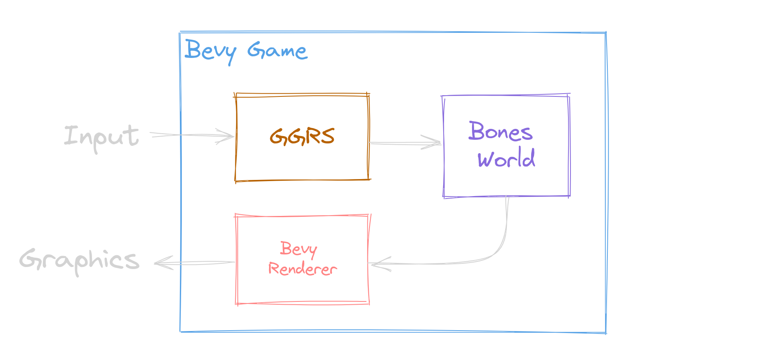

<!--
Major points to cover:

- Why we we felt the need to move away from Bevy to our own solution.
- How we moved piece-by-piece away from Bevy to Bones.
- What the technology ended up, and how it works.
 -->

### From Bevy to Bones

<!-- .slide: data-timing="10" -->

**"Accidentally" Making a Game Engine**

Notes:

- Hey everyone!
- Today I'm going to talk about mine and the Jumpy community's journey from Bevy to Bones
- as we "accidentally" made a game engine.

---

<!-- .slide: data-auto-animate data-timing="5" -->

Isn't This a _Bevy_ Meetup?

Notes:

- The first thing you might be asking is, "isn't this a _Bevy_ meetup?
- The answer to that of course is yes, but
- as you'll see ⏭

---

<!-- .slide: data-auto-animate data-timing="10" -->

Isn't This a _Bevy_ Meetup?

Yes, **we couldn't have made <u>Bones</u> without <u>Bevy</u>**

Bones is like Bevy's **little brother**

<!-- .element: class="fragment" style="margin-top: 1em"  -->

Notes:

- we couldn't have made Bones without Bevy
- Bones was **heavily** influenced by Bevy's design and is in fact
- ⏭️ kind of like Bevy's little brother.

---

## What is Jumpy?

<!-- .slide: data-timing="10" data-background-video="jumpy-presentation.webm" data-background-video-muted="true" data-background-opacity="0.50" data-background-video-loop="true" -->

2D <!-- .element: class="fragment fade-left"  -->

Multiplayer <!-- .element: class="fragment fade-right"  -->

Shooter Game <!-- .element: class="fragment fade-up"  -->

✨ With Modding ✨ <!-- .element: class="fragment"  -->

Notes:

- That brings us to "What is Jumpy?"
- Jumpy is a
- ⏭ ️2D
- ⏭️ Multiplayer
- ⏭️ Shooter Game
- that's all about fun couch play, emergent gameplay, and importantly ⏭️
- ✨ _modding_ ✨

---

### Rewriting Jumpy In Bevy

<!-- .slide: data-timing="8" -->

<ul>
    <li>Jumpy was using <a href="https://macroquad.rs/" target="_blank">Macroquad</a></li>
    <li>But we were already using Bevy for <a href="https://github.com/fishfolk/punchy/" target="_blank">Punchy</a></li>
</ul>

Notes:

- When I took over as lead developer for Jumpy, it was currently written with Macroquad.
- But we were already using bevy for Punchy, another game in the Fish Folk universe, and it was going very well.

---

### Advantages to Bevy

<!-- .slide: data-timing="30" -->

- Large community
- Good cross-platform support
- We already had prior Bevy investments:
  - Nested YAML Asset System
  - Scripting: <code style="font-size: 0.7em; margin-left: 0.5em;">bevy_mod_js_scripting</code>

Notes:

- That led us to consider rewriting Jumpy in Bevy.
- There were some compelling advantages.
- For one, Bevy head a large and growing community, which had already shown a lot of ability to get things done
- It had good cross-platform and rendering support, and
<!-- - While I'm not the most experienced with Macroquad, when I started work on Jumpy, the developer before me was writing a new renderer to overcome limitations in Macroquad, so switching to Bevy seemed preferable to maintaining our own renderer. -->
- we already had investments in Bevy.
- For Punchy, I had created a nest YAML asset loading system, so we could hot reload all of our config.
- Most importantly, Bevy had up-and-coming scripting support. This was through the `bevy_mod_js_scripting` plugin, which I had just finished contributing to in order to get web support, and we had a working proof-of-concept already in Punchy.

---

### Start Working! 👨‍🔧

<!-- .slide: data-timing="15" -->

    
    
+

    

    
Maps Loading

    
Physics Ported

    
Main Menu

    
Map Editor

Notes:

- So to enable modding and to use the same engine for more of our games, we started rewriting Jumpy in Bevy.
- This actually went really well. We got
- ⏭️ maps loading,
- ⏭️ physics ported,
- the ⏭️ main menu,
- and even had the start to an in-game ⏭️ map editor, all in pretty good time.
- Then came the next big hurdle, and something I had never done before

---

<!-- .slide: data-auto-animate data-timing="10" data-background-image="networking-cc0-upscaled.png" data-background-opacity="0.85" data-background-transition="zoom" -->

<h2>Networking</h3>

Notes:

- Networking.

---

<!-- .slide: data-auto-animate data-timing="10" -->

<h2 style="position: relative; top: -1em">Networking</h2>

<h3 style="color: #22D491;">Naïve Client-Server</h4>

- Horrible skipping and jittering during play
- Networking code is mixed with gameplay code

Notes:

- I started off with a client-server model, running a headless Bevy instance on the server and synchronizing transforms.
- While it kind of worked, the players were constantly skipping and jittering around during play.
- Additionally, the networking code had to be mixed in with the gameplay code. It was easy to make a change in the game that would
  break networking unintentionally.

---

<!-- .slide: data-timing="1" -->

<h2 style="position: relative; top: -1em">Networking</h2>

<h3 style="color: #22D491;">Client-Server With Latency Compensation</h4>

- Requires some form of sync-then-fast-forward.

Notes:

- After doing more research I found out that, in order to get smoother network play, I have to take into account the network latency between the client and the server.
- This means that when the client gets an update from the server, the game must realize that the update actually came from, say 100ms ago, because of the network ping, and
  then it has to actually play the game in fast-forward, behind the scenes, to catch up to the present time.
- This was doable, for sure, but if I was going to bother with syncing and fast-forwarding, this was going to be harder than I thought, and it was worth considering another networking model first.

---

<!-- .slide: data-timing="30" -->

<h2 style="position: relative; top: -1em">Networking</h2>

<h3 style="color: #22D491;">Peer-to-Peer Rollback</h4>

- Doesn't require servers!
- Requires <u>Determinism</u> and <u>Snapshot & Restore</u>
- Gameplay code doesn't mix with network code.

Notes:

- Peer-to-peer rollback networking does a similar rewind and fast-forward thing, but it doesn't require running a headless Bevy instance on a server.
- That's really handy for making network gaming inexpensive or even free, which is a big deal for our idea of "Everlasting games".
- The caveat is that it requires the game to be deterministic, and to support snapshot and restore.
- These features are harder to get than they might seem, but there's a great payoff.
- The peer-to-peer model gets you essentially the most fair and best feeling networking out of any other solution I've found.
- It also had one other big advantage:
- The networking code could stay completely separate from the gameplay code.
- This would make it **way** easier for us to ensure that network games worked just as well as local games.
- Lucky for us, Bevy already had peer-to-peer networking plugin, called Bevy GGRS.

---

<!-- .slide: data-timing="30" data-auto-animate -->

### Bevy GGRS

- Might run up to 8 game updates in a single frame
- Each game update must finish in less than 2ms
- `bevy_mod_js_scripting` was not fast enough on web
- No more scripting for now.

Notes:

- We started using Bevy GGRS for Jumpy, and we were very happy with how it simplified the game code.
- Unfortunately we ran into a performance problem with our scripting solution.
- Since GGRS has to do rollbacks and fast-forwards depending on network conditions, it may run the game update up to 8 times in a single render frame.
- This means that our game update, if we are targeting 60 frames-per-second, has to finish within 2 milliseconds!
- Unfortunately, we found out that the `bevy_mod_js_scripting` plugin had too much overhead on web, even though it worked fine on native.
- It's just not very fast to make calls out of WASM into the browser.
- So for now, we decided to just remove scripting and look more into it later.

---

<!-- .slide: data-auto-animate data-timing="30" -->

### Bevy GGRS

- ✅ &nbsp; Handles the snapshot / restore for you!
- ❌ &nbsp; You have to be careful not to break snapshots or determinism:
  - Can't use events or `Local<State>` parameters
  - `GlobalTransform`s can't be read
  - All queries must be sorted
  - You must attach a `RollbackId` to synced entities
  - You must be careful with entity hierarchies in some situations
  - Storing `Entity`s in components requires implementing `MapEntities`

Notes:

- As we continued to use Bevy GGRS, we ran into quite a few gotchas.
- Bevy's design is very focused on performance, and that, in most cases, comes at the expense of determinism.
- On top of that, very little in Bevy lends itself to snapshot and restore.
- This meant that there were a lot of Bevy features we either couldn't use, or had to be extra careful with.
- Things like events, `Local` system params, and `GlobalTransforms` couldn't be used.
- Almost all queries had to be collected into a vector and sorted before we could safely iterate over them, to avoid the non-deterministic iteration order.
- Finally, you have to attach rollback IDs to entities you want to sync,
- you have to be careful with how you use hierarchies,
- and storing `Entity`s in components requires implementing an extra `MapEntities` trait.
- All of these things were really easy to miss, and it was now a looming threat that with every change we made to the game, we could accidentally break determinism.
- It felt like a new kind of "undefined behavior" to avoid, and in that respect, all the code was now `unsafe`.
- These issues weren't GGRS's fault, there were just no good ways get deterministic snapshot restore in Bevy.

---

<!-- .slide: data-timing="10" -->

### A Deterministic Box

A _tiny_ ECS

With a `World` that you can `.clone()`

Notes:

- This led to a good deal of thinking about possible solutions.
- We could re-consider client-server, but it felt like we'd still have a similar feeling of "undefined behavior" by having to do network-specific handling
  all throughout our gameplay code again.
- I started thinking about what it would take to put the Jumpy's core gameplay logic in it's own deterministic "Box".
- We could make our own simple ECS that we could use, and we could make the whole world `.clone()`-able so that it would be trivial to snapshot and restore.
- Or better than making our own, we could just find somebody else who did it.

---

<!-- .slide: data-timing="10" -->

### Bone ECS: First Pass

- Start with a fork of Planck ECS
- Planck component storage is built on `Vec<T>` and bitsets
- Modify component storage to allow for runtime-defined types
- Bones ECS is easier to script than Bevy ECS

Notes:

- We started off by forking Planck ECS, the simplest Rust ECS I could find.
- Planck used normal Rust vectors for storage, and used bitsets operations to do queries over components.
- The only one major modification I wanted to make to it was to allow us to store runtime-defined types.
- This was a step back in the direction of scripting.
- Because Bones ECS was going to stay small and simple, it would be much easier to implement scripting for.
- While there was promising progress with `bevy_mod_js_scripting` it was also very complicated, and there were still big questions
  about how to make certain things work in scripts, especially when it came to interacting with assets.
- By doing our own scriptable ECS for the gameplay, it would be easier to get the modding experience we were looking for.

---

<!-- .slide: data-timing="10" -->

### Bevy + Bones

  

Notes:

- After finishing the first draft of the Bones ECS, we started porting the core Jumpy gameplay to use it instead of the Bevy ECS.
- This was a big-ish rewrite, and there was a lot more boilerplate than I imagined to get input and rendering types made for Bones.
- We also had to postpone proper asset handling, and a temporary, annoying integration with Bevy's asset server was used to get things rolling.
- The good news was that porting was straight-forward, if tedious.
- By the time we finished, we had a rather interesting architecture.
- When you started a match, it would create a new Bones world, initialize the game, and then start sending input to it.
- We created a bevy system that would render whatever sprites and tilemaps that it found in the bones world.
- For network games, GGRS would send the input to the bones world, as well as instruct it to create or restore snapshots when necessary.
- After a lot of work we finally had a nice and clean architecture, where we didn't have to think constantly about networking.
- We also got an interesting bonus, the Jumpy match gameplay was now renderer agnostic.
- Because it was isolated and deterministic, we could have rendered it in Bevy, or macroquad without changing the gameplay at all.

---

### Problems With Bevy + Bones

- Now we have two ECS's to deal with
- The asset integration is annoying
- The Bones world can't render UI

Notes:

- There were still things to be desired, though.
- Having to deal with two different ECS's and schedulers could be confusing.
- The asset integration still required annoying conversions between bones and bevy asset paths.
- And the bones world couldn't render UI, because all the UI was in the outer Bevy shell.

---

### Bones Framework

- Create a new Bones Framework
- Start moving pieces of Jumpy into Bones
  - Egui & Widgets
  - GGRS & Networking
- Use a multi-`World` pattern to keep core gameplay isolated
- Make Bevy a supported Bones Framework renderer
- Create a proper Bones asset server

Notes:

- The next step, was to create a unified Bones Framework.
- We would start moving pieces of Jumpy into the new framework, such as the Egui widgets and the networking logic.
- We would use a multi-`World` strategy, so that the menu could be in one Bones world and easily create, start, and stop separate, isolated gameplay worlds.
- This multi-`World` setup let us keep all the great advantages of having a separate gameplay world, while only needing to learn one ECS.
- The end result, is that the whole entire game could be made with Bones alone.
- Then we would use Bevy as a rendering integration.
- Bones games are renderer agnostic, they take bones-formatted input and create standardized rendering components for sprites, tilemaps, etc.
- Any renderer that could render sprites, tilemaps, egui, and debug lines, could be integrated as a Bones Framework renderer, but Bevy would be our official renderer.
- The can of worms in this whole setup was the asset server.

---

### Bones Asset Server

- Assets are either `Metadata` assets or `Custom` assets
- `Metadata` assets:
  - are loaded from YAML files
  - can reference other assets in a hierarchy
  - are automatically deserialized into Rust structs

Notes:

- The Bones asset server was going to better facilitate the way we handled assets in Jumpy and Punchy.
- In order to allow all of our game config to be hot reloaded, and easily organized, we had a system
  where we could derive a bevy asset loader for Rust structs using `serde`.
- It would automatically deserialize Bevy handles from relative paths to other assets, and it made
  it very nice for loading lots of assets in a hierarchy, with extra metadata in the YAMl files
  wherever we needed it.
- The derive setup, though, had some rough edges and with our own asset server, we could make it
  really seamless.
- We could also add first-class support for asset and mod packs.

---

### Bones Asset Server

- Assets are either `Metadata` assets or `Custom` assets
- `Metadata` assets:
  - are loaded from YAML files
  - can reference other assets in a hierarchy
  - are automatically deserialized into Rust structs

Notes:
