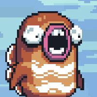

<!--
Major points to cover:

- Why we we felt the need to move away from Bevy to our own solution.
- How we moved piece-by-piece away from Bevy to Bones.
- What the technology ended up, and how it works.
 -->

### From Bevy to Bones

<!-- .slide: data-timing="10" -->

**"Accidentally" Making a Game Engine**

Notes:

- Hey everyone!
- Today I'm going to talk about mine and the Jumpy community's journey from Bevy to Bones
- as we "accidentally" made a game engine.

---

<!-- .slide: data-auto-animate data-timing="5" -->

Isn't This a _Bevy_ Meetup?

Notes:

- The first thing you might be asking is, "isn't this a _Bevy_ meetup?
- The answer to that of course is yes, but
- as you'll see ⏭

---

<!-- .slide: data-auto-animate data-timing="10" -->

Isn't This a _Bevy_ Meetup?

Yes, **we couldn't have made <u>Bones</u> without <u>Bevy</u>**

Bones is like Bevy's **little brother**

<!-- .element: class="fragment" style="margin-top: 1em"  -->

Notes:

- we couldn't have made Bones without Bevy
- Bones was **heavily** influenced by Bevy's design and is in fact
- ⏭️ kind of like Bevy's little brother.

---

## What is Jumpy?

<!-- .slide: data-timing="10" data-background-video="jumpy-presentation.webm" data-background-video-muted="true" data-background-opacity="0.50" data-background-video-loop="true" -->

2D <!-- .element: class="fragment fade-left"  -->

Multiplayer <!-- .element: class="fragment fade-right"  -->

Shooter Game <!-- .element: class="fragment fade-up"  -->

✨ With Modding ✨ <!-- .element: class="fragment"  -->

Notes:

- That brings us to "What is Jumpy?"
- Jumpy is a
- ⏭ ️2D
- ⏭️ Multiplayer
- ⏭️ Shooter Game
- that's all about fun couch play, emergent gameplay, and importantly ⏭️
- ✨ _modding_ ✨

---

### Rewriting Jumpy In Bevy

<!-- .slide: data-timing="8" -->

<ul>
    <li>Jumpy was using <a href="https://macroquad.rs/" target="_blank">Macroquad</a></li>
    <li>But we were already using Bevy for <a href="https://github.com/fishfolk/punchy/" target="_blank">Punchy</a></li>
</ul>

Notes:

- When I took over as lead developer for Jumpy, it was currently written with Macroquad.
- But we were already using bevy for Punchy, another game in the Fish Folk universe, and it was going very well.

---

### Advantages to Bevy

<!-- .slide: data-timing="30" -->

- Large community
- Good cross-platform support
- We already had prior Bevy investments:
  - Nested YAML Asset System
  - Scriptable ECS: <code style="font-size: 0.7em; margin-left: 0.5em;">bevy_mod_js_scripting</code>

Notes:

- That led us to consider rewriting Jumpy in Bevy.
- There were some compelling advantages.
- For one, Bevy head a large and growing community, which had already shown a lot of ability to get things done
- It had good cross-platform and rendering support, and
<!-- - While I'm not the most experienced with Macroquad, when I started work on Jumpy, the developer before me was writing a new renderer to overcome limitations in Macroquad, so switching to Bevy seemed preferable to maintaining our own renderer. -->
- we already had investments in Bevy.
- For Punchy, I had created a nest YAML asset loading system, so we could hot reload all of our config.
- Most importantly, Bevy had up-and-coming scripting support. This was through the `bevy_mod_js_scripting` plugin, which I had just finished contributing to in order to get web support, and we had a working proof-of-concept already in Punchy.

---

### Start Working! 👨‍🔧

<!-- .slide: data-timing="15" -->

    
    
+

    

    
Maps Loading

    
Physics Ported

    
Main Menu

    
Map Editor

Notes:

- So to enable modding and to use the same engine for more of our games, we started rewriting Jumpy in Bevy.
- This actually went really well. We got
- ⏭️ maps loading,
- ⏭️ physics ported,
- the ⏭️ main menu,
- and even had the start to an in-game ⏭️ map editor, all in pretty good time.
- Then came the next big hurdle, and something I had never done before

---

<!-- .slide: data-auto-animate data-timing="10" data-background-image="networking-cc0-upscaled.png" data-background-opacity="0.85" -->

<h2>Networking</h3>

Notes:
- Networking.

---

<!-- .slide: data-auto-animate data-timing="10" data-background-image="networking-cc0-upscaled.png" data-background-opacity="0.85" -->

<h2>Networking</h3>

Naïve Client-Server

With Horrible Visual Glitching

Notes:
- I started off with a client-server model, running a headless Bevy instance on the server and synchronizing transforms.
- This had horrible visual glitching because players were skipping around and jittering constantly.
- It was a good POC, but now I had to figure out how to make things look nice.

---

<!-- .slide: data-auto-animate data-timing="10" data-background-image="networking-cc0-upscaled.png" data-background-opacity="0.85" -->

<h2>Networking</h3>

Client-Side Prediction

Needs Rewind and Fast-Forward

Notes:
- After doing more research I found that the answer is to do "client-side-prediction", which basically means being able to run the game,
but be to jump back to server snapshots, while fast-forwarding the game back to the present to compensate for latency.

---

<!-- .slide: data-auto-animate data-timing="10" data-background-image="networking-cc0-upscaled.png" data-background-opacity="0.85" -->

<h2>Networking</h3>

Determinism

&

Snapshot / Restore

